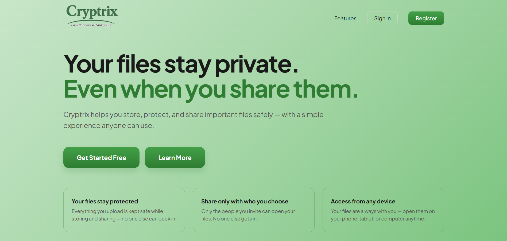

# Cryptrix

Cryptrix is a cross-platform secure file encryption application designed to protect sensitive files using modern cryptographic techniques.  
The project provides both a responsive web application and a mobile application for secure file handling and encryption.

---

## Cross Platform Support

### Website : https://cryptrix-delta.vercel.app/

### Mobile Apk : Android APK support available.

---

## Key Features

- Secure file encryption using password-based protection
- PBKDF2-based cryptographic key derivation
- Cross-platform support for web and Android
- Simple and fast file encryption workflow
- User Sign In and Registration system
- Responsive interface for desktop and mobile devices
- Modern and clean user interface
- Lightweight and optimized performance

---

## Technologies Used

- Frontend - HTML5, CSS3, JavaScript
- Mobile Application - Flutter, Dart
- Backend - Node.js
- Database - Supabase
- Security - PBKDF2, File Encryption Techniques

---

## Screenshots

### Web Application

#### 

### Mobile Application

  
  
  
  
  

## Security Highlights

### Secure File Encryption
Cryptrix encrypts files before storage or transfer, ensuring that sensitive information remains protected from unauthorized access.

### Password-Based Protection
Files are protected using user-defined passwords, adding an additional security layer during encryption and decryption.

### PBKDF2 Key Derivation
The application uses PBKDF2 (Password-Based Key Derivation Function 2) to generate secure encryption keys from user passwords. This strengthens password security and reduces vulnerability to brute-force attacks.

### Secure Password Handling
User passwords are securely processed and are not directly exposed during encryption operations.

### Data Privacy
Cryptrix focuses on protecting confidential information and maintaining user privacy during file handling operations.

### Protected File Workflow
The encryption workflow is designed to securely process files while minimizing the risk of accidental exposure or unauthorized modification.

---

## Use Cases

- Personal file protection
- Secure document sharing
- Academic file security
- Password-protected storage
- Confidential data handling
- Secure digital communication
- Small business document protection
- Cross-platform secure file access

---
## 👨‍💻 Author

- 📧 Email: [u337744@gmail.com](mailto:u337744@gmail.com)
- 🐙 GitHub: [@Ashwinssushil](https://github.com/Ashwinssushil)

## 📞 Support

Have questions or need help? [Open an issue](../../issues) in this repository.

---

**⭐ Star this repository if you found it helpful!**
